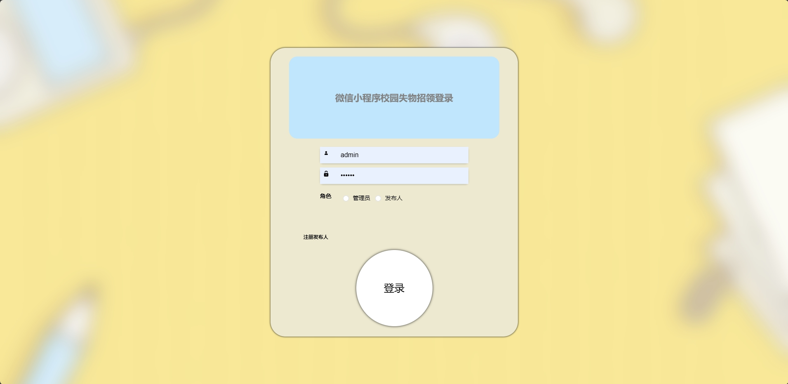
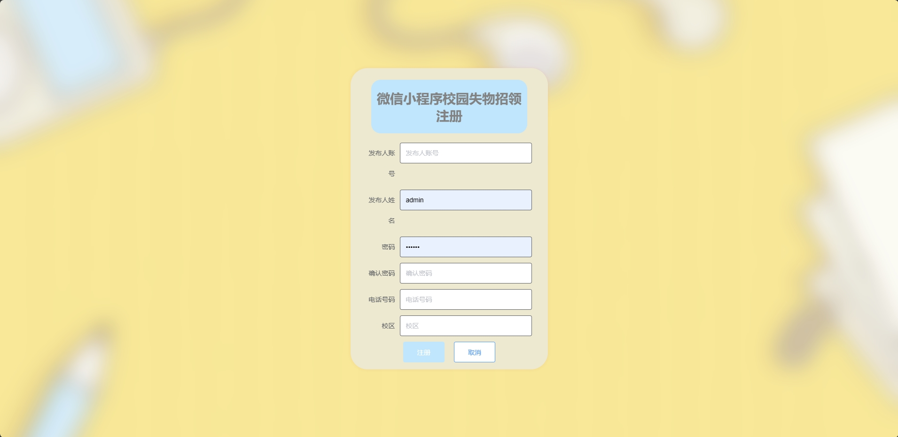
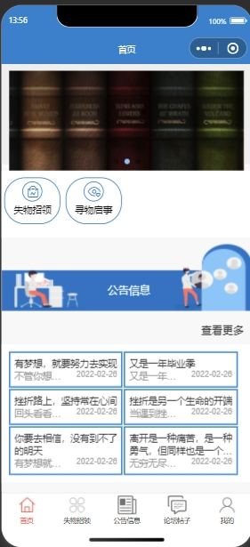
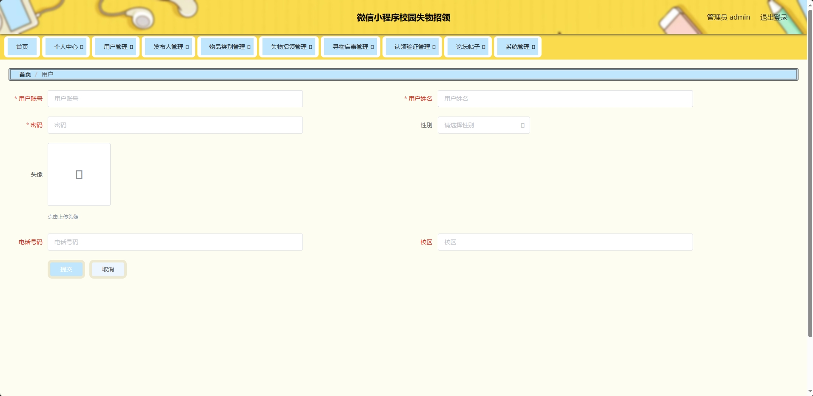
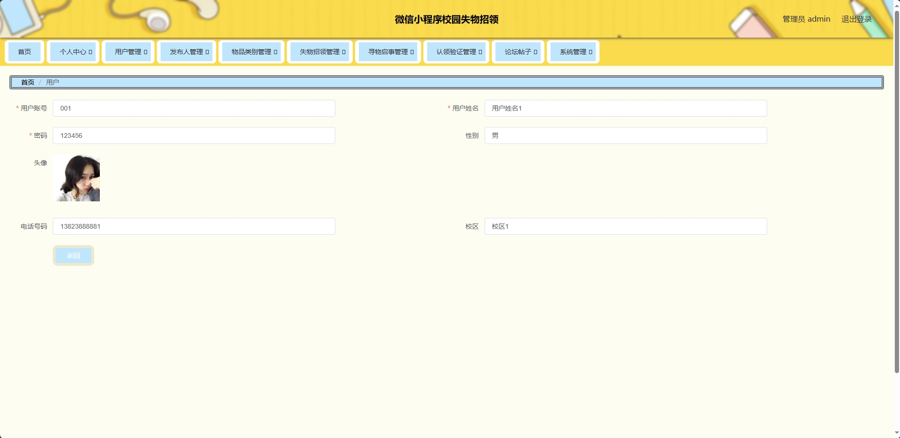
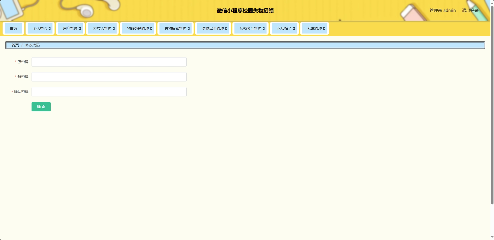

<h1 align="center">基于微信小程序校园失物招领系统</h1>

 获取sql文件 QQ: 605739993 QQ群: 377586148 

 [个人站点: 从戎源码网](https://armycodes.com/)

## 简介

> 本代码来源于网络,仅供学习参考使用!
>
> 提供1.远程部署/2.修改代码/3.设计文档指导/4.框架代码讲解等服务
>
> 前端地址：http://localhost:8080/ssm753as/admin/dist/index.html#/index（Tomcat启动） |  http://localhost:8081/（NodeJs启动）
>
> 管理员: admin 密码: 123456
> 
> 发布人：0001 密码：123456
>
> 用户：001 密码: 123456

## 项目介绍

基于微信小程序校园失物招领系统：前端 微信小程序、ElementUI、Vue，后端 SpringMvc、Mybatis，系统角色分为：管理员、发布人和用户，管理员在管理后台物品信息，对物品种类进行管理，管理认领和失物招领启示等；发布人可以对认领和寻物启事进行管理等；用户根据发布的寻物和失物招领信息进行相关操作、客服聊天等。主要功能如下：

### 启动方式

- 前端：
> 按钮启动 | 启动Tomcat
> 
> 微信小程序启动

- 后端：
> 按钮启动 | 启动Tomcat

### 管理员：

- 基本操作：登录、修改密码、获取个人信息、在线客服、图片上传
- 用户管理：新增用户、获取用户列表、筛选用户信息、查看用户信息详情、修改用户信息、删除用户
- 发布人管理：新增发布人、获取发布人列表、筛选发布人信息、查看发布人信息详情、修改发布人信息、删除发布人
- 物品类别管理：新增物品类别、获取物品类别信息列表、筛选物品类别信息、查看物品类别信息详情、修改物品类别信息、删除物品类别信息
- 失物招领管理：筛选失物招领信息、修改失物招领信息、删除失物招领信息、查看失物招领信息
- 寻物启事管理：筛选寻物启事信息、修改寻物启事信息、删除寻物启事信息、查看寻物启事信息
- 认领验证管理：筛选认领验证信息、修改认领验证信息、删除认领验证信息、查看认领验证信息
- 论坛帖子管理：新增帖子、获取帖子列表、筛选帖子信息、查看帖子详情、修改帖子信息、删除帖子
- 轮播图管理：新增轮播图、删除轮播图、筛选轮播图、获取轮播图列表、查看轮播图详情
- 公告管理：新增公告、删除公告、筛选公告、获取公告列表、查看公告详情

### 发布人：

- 基本操作：登录、修改密码、获取个人信息、图片上传、注册
- 失物招领管理：新增失物招领、筛选失物招领信息、修改失物招领信息、删除失物招领信息、查看失物招领信息
- 寻物启事管理：筛选寻物启事信息、修改寻物启事信息、删除寻物启事信息、查看寻物启事信息
- 认领验证管理：筛选认领验证信息、修改认领验证信息、删除认领验证信息、查看认领验证信息

### 用户：

- 基本操作：登录、注册、修改个人信息、查看基本资料、忘记密码、获取轮播图列表、在线客服
- 失物招领：获取失物招领列表、查看失物招领详情、筛选失物招领信息、认领、认领验证、获取认领验证列表、筛选认领验证信息
- 寻物启事：获取寻物启事列表、查看寻物启事详情、筛选寻物启事信息、发布寻物启事
- 公告信息：获取公告信息列表、查看公告信息详情、筛选公告信息
- 论坛帖子：获取帖子列表、查看帖子详情、筛选帖子信息、评论、获取回复列表、回复、发帖、获取发帖列表

## 环境

- <b>IntelliJ IDEA 2020.3</b>

- <b>Mysql 5.7.26</b>

- <b>Tomcat 9.0.41</b> | <b>NodeJs 14.17.3</b>

- <b>Maven 3.6.3</b>

- <b>JDK 1.8</b>

## 运行截图

